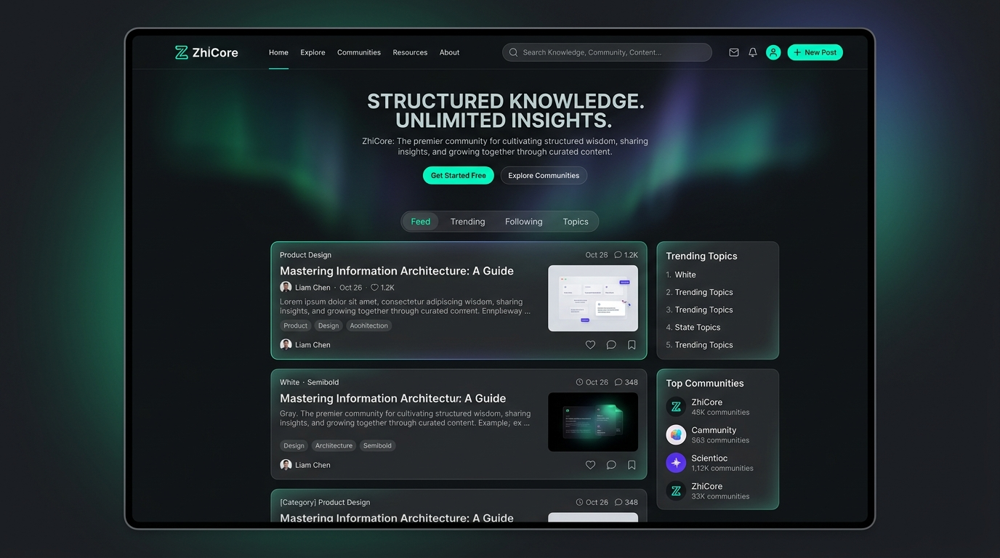

# 知构（ZhiCore）品牌 UI 设计系统

知构作为内容社区与结构化知识管理平台，其品牌调性定位为：**“克制、专注、可靠”**。为了让界面既能服务于高频、专注的写作与阅读流程，又能在第一眼带给用户精致、专业、极具现代感的视觉冲击力，我们制定了本套完整的品牌 UI 设计系统。

> [!IMPORTANT]
> 当前实际落地 UI 风格以 [ui-style-baseline.md](ui-style-baseline.md) 为准。本文保留品牌概念、首页 / 登录页等高表达场景的视觉方向；内容浏览页、社区页、阅读页和设置页不应机械套用玻璃卡片或营销式 hero。

---

## 视觉概念预览

以下为知构（ZhiCore）高保真品牌视觉设计概念图：



> [!NOTE]
> 该视觉系统融合了极光微光背景（Aurora Backdrop Glow）、玻璃态容器（Glassmorphism）、高对比度卡片结构与精致的标签体系，呈现极具科技感与知识沉淀感的技术社区面貌。

---

## 一、 品牌色彩系统 (Brand Color System)

我们采用精细调和的 HSL 颜色系统，保证明暗模式下的可读性、对比度（符合 WCAG AA 级标准）与视觉品质感。

### 1. 基础调色盘 (Base Palette)

| 语义角色                 | 亮色模式 (Light)            | 暗色模式 (Dark)             | 视觉释义                                 |
| :----------------------- | :-------------------------- | :-------------------------- | :--------------------------------------- |
| **背景色 (Bg)**          | `hsl(210, 40%, 98%)`        | `hsl(224, 71%, 4%)`         | 亮色为清爽淡蓝灰，暗色为深邃星空黑蓝     |
| **板面板 (Panel)**       | `hsl(0, 0%, 100%)`          | `hsl(222, 47%, 11%)`        | 卡片与主内容板的底色                     |
| **主强调色 (Primary)**   | `hsl(221, 83%, 53%)`        | `hsl(198, 93%, 60%)`        | 用于核心操作、主链接、键盘焦点           |
| **品牌特征色 (Accent)**  | `hsl(170, 80%, 30%)`        | `hsl(168, 80%, 40%)`        | 极光绿，用于结构整理、成功状态、高光元素 |
| **强文字 (Text Strong)** | `hsl(222, 47%, 11%)`        | `hsl(210, 40%, 98%)`        | 标题、高亮文本                           |
| **常规文字 (Text)**      | `hsl(215, 25%, 27%)`        | `hsl(215, 20%, 80%)`        | 正文、普通描述                           |
| **次要文字 (Text Soft)** | `hsl(215, 16%, 47%)`        | `hsl(215, 16%, 60%)`        | 时间、计数器、辅助注释                   |
| **边框色 (Border)**      | `hsla(215, 16%, 47%, 0.12)` | `hsla(215, 20%, 80%, 0.16)` | 极细描边，保持界面通透                   |

### 2. 极光背景微光 (Aurora Glow Backgrounds)

采用多重镜像渐变重叠，营造高端科技感：

- **Cyan-Teal Glow**: `radial-gradient(circle at top right, hsla(168, 80%, 40%, 0.08), transparent 60%)`
- **Indigo-Blue Glow**: `radial-gradient(circle at bottom left, hsla(221, 83%, 53%, 0.06), transparent 50%)`

---

## 二、 玻璃态容器规范 (Glassmorphism Specifications)

为了让卡片更具层次感，卡片容器引入层叠微阴影与透明材质过滤：

```css
.glass-panel {
  background: color-mix(in srgb, var(--color-bg-elevated) 85%, transparent);
  backdrop-filter: blur(12px);
  -webkit-backdrop-filter: blur(12px);
  border: 1px solid var(--color-border);
  box-shadow:
    0 1px 2px rgba(0, 0, 0, 0.02),
    0 8px 24px -4px rgba(0, 0, 0, 0.04);
}
```

---

## 三、 文字与排版层次 (Typography & Hierarchy)

- **界面字体**: 优先采用 `Inter`, `Outfit`, `Segoe UI` 等具备优秀字母比例的字体，中文搭配 `Noto Sans SC`（思源黑体）或系统默认无衬线字体。
- **字重规范**:
  - 主标题 (H1) / 超大数值: `font-weight: 850;` (极粗，用于塑造视觉焦点)
  - 卡片标题 (H3) / 按钮: `font-weight: 750;` (中粗，稳重且易识别)
  - 正文: `font-weight: 400;` (常规，保障长时间阅读不疲劳)
- **行高与缩进**:
  - 界面标签: `line-height: 1.1;`
  - 正文描述: `line-height: 1.65;` `letter-spacing: -0.011em;`

---

## 四、 页面微交互规格 (Micro-interactions)

知构的页面交互应是“直觉而平滑的”：

1.  **卡片悬停 (Card Hover Liftoff)**
    卡片被悬停时，应用平滑的贝塞尔曲线进行上浮与阴影扩张：
    ```css
    transition:
      transform 0.25s cubic-bezier(0.4, 0, 0.2, 1),
      box-shadow 0.25s cubic-bezier(0.4, 0, 0.2, 1),
      border-color 0.2s ease;
    transform: translateY(-2px);
    box-shadow: 0 12px 28px -8px rgba(0, 0, 0, 0.08);
    ```
2.  **快捷项缩进 (Indicator Slide)**
    分类列表或关键指标激活时，左侧高亮描边平滑延展，文字向右轻微推开 `4px`，带来出色的物理感知。
3.  **极简图标旋转 (Icon Interaction)**
    箭头、钢笔等动作图标在鼠标悬停时进行微比例放大 (`scale(1.08)`)，增添灵动感。

---

## 五、 后续实施计划 (Implementation Steps)

1.  [x] **引入基础 HSL 设计 Token**：将本设计系统的色彩与排版参数写入全局 CSS 配置文件 [style.css](file:///home/azhi/workspace/projects/zhicore-frontend-vue/src/style.css)。
2.  [x] **彻底重构首页组件结构**：依据视觉图，全面调整卡片与栏目比例，增强暗色模式下的微光质感。
3.  [x] **应用全局卡片/交互微动效**：确保在不破坏 Vitest 自动化测试护栏的前提下，将精细的交互逻辑推行至全站。
